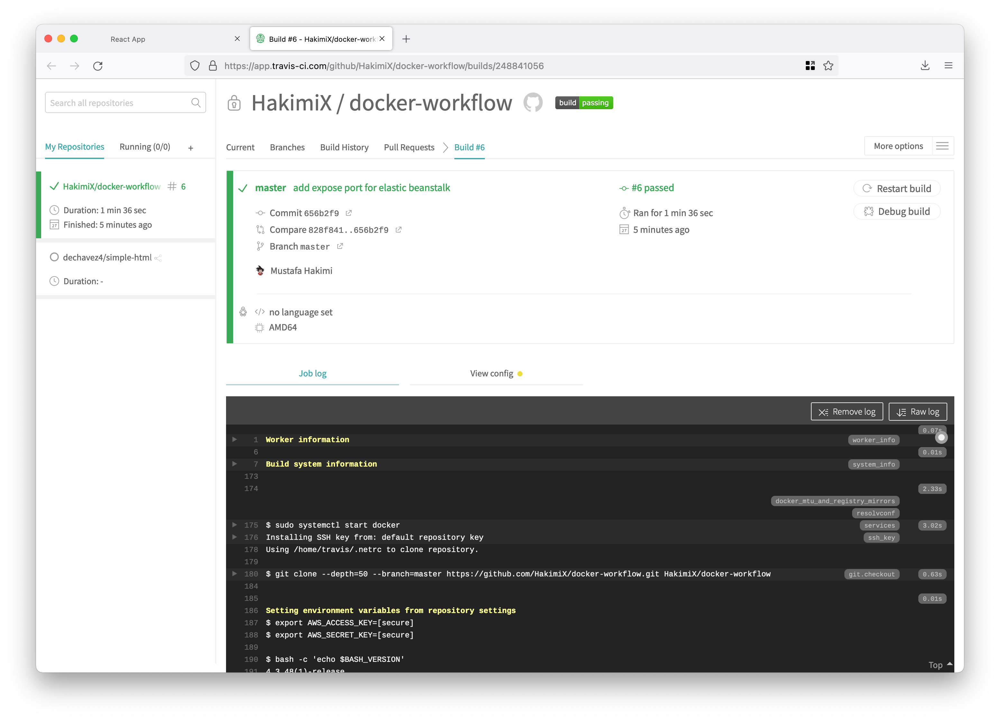
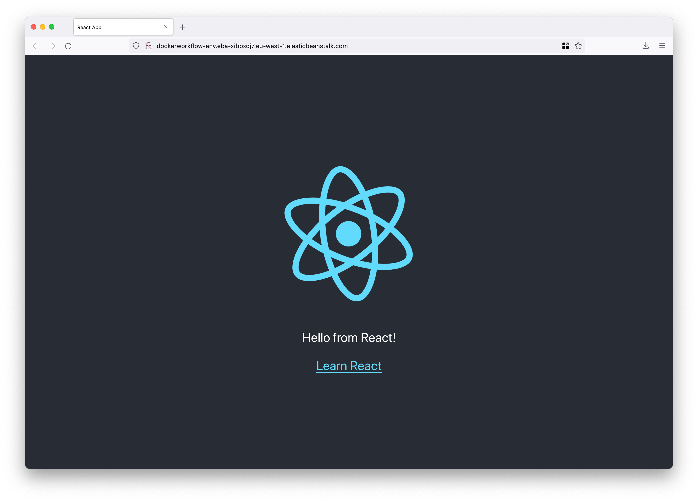

# Docker Worflow 

Deploy a React app using GitHub, Travis CI, Nginx and AWS.

* [Project Structure](#project-structure)
* [Docker](#docker)
  * [Dockerfile](#dockerfile)
  * [Dockerfile.dev](#dockerfiledev)
  * [Docker Compose](#docker-compose)
* [Nginx](#nginx)
* [Travis CI](#travis-ci)
* [AWS](#aws)

### Project Structure 
Node version: 
```Shell 
v14.18.1
```
Generic React project created with: 
```shell
npx create-react-app frontend
```
```shell
# Start the dev server
npm run start 

# Run tests 
npm run test

# Build a production version of the app
npm run build
```

### Docker 

#### Dockerfile

A Multiphase docker setup is used for the production DockerFile. 

The building phase is responsible for installing dependencies and building
a production version of the app (the `build` directory).

The running phase is using the output from the building phase
(the `build` directory) to serve the app.
```Dockerfile
# Building phase 
FROM node:14-alpine 

# Running phase
FROM nginx
```

Build the image and run the container (nginx server)
```shell
# build the image
docker build -t docker-workflow/react-nginx .

# Run nginx server (nginx runs on port 80)
docker run -p 8080:80 docker-workflow/react-nginx

# Navigate to 
http://localhost:8080
```

#### Dockerfile.dev
Use the `Dockerfile.dev` file for local development
```shell
# Build image 
docker build -f Dockerfile.dev -t docker-workflow/react .

# Run the container 
docker run -p 3000:3000 docker-workflow/react

# Navigate to 
http://localhost:3000
```
Real-time update using volumes
```shell
docker run -p 3000:3000 -v /app/node_modules -v $(pwd):/app docker-workflow/react
```

#### Docker Compose
Start the container 
```shell
docker-compose -f docker-compose-dev.yml up
```
Enter container
```shell
docker exec -it <container> sh 
```

AWS Elastic Beanstalk will look for a `docker-compose.yml` file to build from 
by default instead of a Dockerfile. 

### Nginx 
Nginx is used to serve the application in production.

### Travis CI

[Travis dashboard](https://app.travis-ci.com/github/HakimiX/docker-workflow)

The AWS IAM credentials (acces key and secret key) are stored as 
environment variables in Travis CI. 



### AWS 
The app is deployed using AWS Elastic Beanstalk which will create an environment 
(security groups, load balancer, etc.) and automatically scale everything. 

Travis CI will put artifacts (code) into a s3 bucket. 

Navigate to the Elastic Beanstalk URL.

